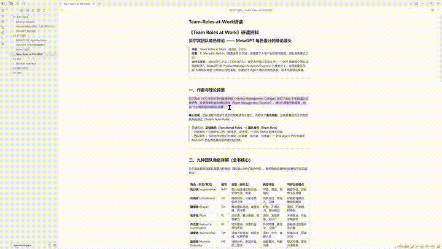

# 快翻译 Kuaifanyi

An Obsidian plugin that translates and reads aloud instantly. Short words get a dictionary lookup (Youdao-style), long text gets streaming translation, with AI explanation and neural TTS.

<p align="center">
  
</p>

## ✨ Features

| Feature | Description |
|---------|-------------|
| 🎯 **Dual Mode** | Short words → dictionary (phonetics, multi-domain definitions, examples) · Long text → streaming translation, typewriter rendering |
| 🌐 **Auto Direction** | Chinese → English, others → Chinese. No manual setting. |
| 💡 **AI Explanation** | Parallel streaming explanation alongside translation |
| 🔊 **Neural TTS** | Volcano Engine (ByteDance) large model voices — 13 verified voice styles, **supports voice cloning** (paste a `S_xxx` ID from the Volcano console) |
| 🪟 **Smart Popup** | Follows selection, tracks scrolling, draggable, resizable, golden ratio by default |
| 🤖 **Auto Model Discovery** | Fetches available models from your API endpoint into a dropdown |
| ⚡ **Configurable Trigger** | Direct select / Ctrl+Select, adjustable debounce |
| 🔌 **OpenAI Compatible** | Default DeepSeek; switch to any OpenAI-format endpoint (Kimi, GLM, Ollama…). Long text auto-chunked. |

## 📦 Install

1. Download `main.js`, `manifest.json`, `styles.css` from [Releases](../../releases)
2. Copy into `<vault>/.obsidian/plugins/kuaifanyi/`
3. Restart Obsidian → Settings → Community Plugins → enable **快翻译 (Kuaifanyi)**

## ⚙️ Setup

### Translation API (required)
- **DeepSeek** (default): get a key at [platform.deepseek.com](https://platform.deepseek.com/api_keys)
- **Custom**: any OpenAI-compatible endpoint (Kimi, Zhipu, Ollama, local LLM…)

### Volcano TTS (optional, recommended)
1. [Volcano Engine Console](https://console.volcengine.com/speech) → activate **Speech Synthesis Large Model**
2. Create an app → grab **AppID** + **Access Token**
3. Plugin settings → TTS → paste them
4. **Voice cloning**: Console → Sound Replication → record 10s → get a `S_xxx` voice ID → select "Custom Clone" in the voice dropdown and paste it

## 🛠 Dev

```bash
npm install
npm run dev    # watch mode
npm run build  # production
```

Tech: TypeScript + esbuild + Obsidian API (`requestUrl` / SSE streaming / Web Speech / Volcano TTS HTTP API)

## ☕ Sponsor

If this plugin helps you, feel free to support (min **¥5** ~ $0.70):

<table>
  <tr>
    <td align="center"><br><b>WeChat Pay</b></td>
    <td align="center"><br><b>Alipay</b></td>
  </tr>
</table>

## License

MIT

---

# 中文文档

## ✨ 特点

| 特性 | 说明 |
|------|------|
| 🎯 **双模式智能切换** | 短词/缩写自动走**词典模式**（音标、多领域释义、例句，模仿有道）；长句走**流式翻译**，逐字渲染 |
| 🌐 **方向自动识别** | 中文→英文，其它语言→中文，无需设置 |
| 💡 **AI 解释并行生成** | 翻译与解释并行请求、同屏逐字渲染，互不阻塞 |
| 🔊 **豆包神经语音** | 火山引擎大模型语音，13 个实测音色（Vivi 2.0 / 灿灿 / 云舟等），**支持声音克隆**（粘贴 S_xxx ID 即用自己的声音） |
| 🪟 **智能弹窗** | 跟随选区、滚动实时追踪、可拖拽固定、宽高可调、黄金比例默认 |
| 🤖 **模型自动发现** | 填入 API Key 自动拉取可用模型，下拉选择翻译/解释模型 |
| ⚡ **触发可配** | 直接选中 / Ctrl+选中，延迟可调 |
| 🔌 **OpenAI 兼容** | 默认 DeepSeek，可换任意 OpenAI 格式端点；长文本自动分段 |

（安装和配置说明见上方英文文档。）

## ☕ 赞助

如果这个项目对你有帮助，欢迎自由赞助（**最低 ¥5**，心意不分多少）：

<table>
  <tr>
    <td align="center"><br><b>微信支付</b></td>
    <td align="center"><br><b>支付宝</b></td>
  </tr>
</table>
