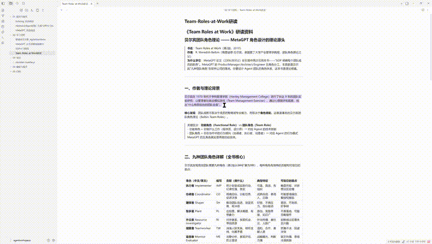

<p align="center">
  
</p>

---

<details open>
<summary><h2 style="display:inline">🇨🇳 中文文档</h2></summary>

# 快翻译 (Kuaifanyi)

> Obsidian 划词翻译插件：选中即译，词典查词 + 流式翻译 + AI 解释 + 豆包神经语音朗读

## ✨ 功能

| 功能 | 说明 |
|------|------|
| 🎯 **双模式智能切换** | 短词/缩写自动走**词典模式**（音标 + 多领域释义 + 例句）；长句走**流式翻译**，打字机逐字渲染 |
| 🌐 **多语言翻译** | 9 种语言可选（中/英/日/韩/法/德/西/葡/俄），源语言和目标语言独立设置，弹窗内一键 ⇄ 交换方向 |
| 💡 **AI 解释（独立语言）** | 翻译和解释**并行流式请求**，互不阻塞；解释语言独立于翻译语言，弹窗内 ⇄ 一键切换中/英 |
| 🔊 **豆包神经语音** | 火山引擎大模型语音合成，16 个音色（中文 10 + 英文 3 + 多语种 3），**支持声音克隆**（粘贴 `S_xxx` ID），朗读时按目标语言自动匹配音色 |
| 🪟 **智能弹窗** | 跟随选区、滚动实时追踪、可拖拽、可调大小；显示翻译/解释语言指示器 |
| 🤖 **模型自动发现** | 填入 API Key 自动拉取可用模型列表，下拉选择翻译/解释模型 |
| 🔌 **多提供商** | DeepSeek / 千问(阿里云) / 豆包(火山方舟) / Kimi(月之暗面) / 智谱 GLM / 自定义 OpenAI 兼容端点 |
| ⚡ **灵活触发** | 直接选中触发 / Ctrl+选中触发，延迟可调（100-2000ms） |
| 💾 **本地缓存** | JSON 索引持久化，翻译/解释/TTS 全量缓存，跨会话复用，重复选中秒出结果 |
| 📊 **用量可视化** | 弹窗底部显示 Token 用量 + API 余额 + TTS 字符用量 |

## 📦 安装

**插件市场安装（推荐）：** Obsidian → 设置 → 社区插件 → 浏览 → 搜索 "Kuaifanyi" → 安装

**手动安装：**
1. 从 [Releases](https://github.com/wjzixi/kuaifanyi/releases) 下载 `main.js`、`manifest.json`、`styles.css`
2. 放入 `<vault>/.obsidian/plugins/kuaifanyi/`
3. 重启 Obsidian → 设置 → 社区插件 → 启用

## ⚙️ 配置

### 1. 翻译 API（必填）

| 提供商 | 获取 Key |
|--------|----------|
| **DeepSeek**（默认） | [platform.deepseek.com/api_keys](https://platform.deepseek.com/api_keys) |
| 千问（阿里云） | [DashScope 控制台](https://dashscope.console.aliyun.com/) |
| 豆包（火山方舟） | [火山方舟控制台](https://console.volcengine.com/ark/) |
| Kimi（月之暗面） | [Moonshot 控制台](https://platform.moonshot.cn/) |
| 智谱 GLM | [智谱开放平台](https://open.bigmodel.cn/) |
| 自定义 | 任意 OpenAI 兼容端点（如 Ollama、local LLM） |

### 2. 火山 TTS（可选，推荐）

1. [火山引擎控制台](https://console.volcengine.com/speech) → 开通「语音合成大模型」
2. 创建应用 → 获取 **AppID** 和 **Access Token**
3. 插件设置 → 朗读 → 填入凭证 → 选择音色
4. **声音克隆**：控制台 → 声音复刻 → 录制 10 秒 → 获取 `S_xxx` ID → 音色选「自定义克隆」

### 3. 语言设置

| 设置项 | 默认值 | 说明 |
|--------|--------|------|
| 源语言 | `自动检测` | 翻译的源语言，支持自动检测 |
| 目标语言 | `中文` | 翻译的目标语言 |
| 解释语言 | `中文` | AI 解释的输出语言 |

> 💡 弹窗内也有 ⇄ 按钮可快捷切换，切换后立即重新翻译/解释

## ☕ 赞助

最低 **¥5**，心意不分多少：

<table>
  <tr>
    <td align="center"><br><b>微信支付</b></td>
    <td align="center"><br><b>支付宝</b></td>
  </tr>
</table>

</details>

<details>
<summary><h2 style="display:inline">🇺🇸 English</h2></summary>

# Kuaifanyi (快翻译)

> Select-to-translate Obsidian plugin: dictionary lookup + streaming translation + AI explanation + Volcano neural TTS

## ✨ Features

| Feature | Description |
|---------|-------------|
| 🎯 **Dual Mode** | Short words → dictionary (phonetics, multi-domain definitions, examples); Long text → streaming translation with typewriter effect |
| 🌐 **Multilingual Translation** | 9 languages (zh/en/ja/ko/fr/de/es/pt/ru); independent source/target settings; one-click ⇄ swap in popup |
| 💡 **AI Explanation (Independent Lang)** | Translation + explanation stream in parallel; explanation language independent from translation; ⇄ toggle in popup |
| 🔊 **Neural TTS** | Volcano Engine big model, 16 voices (10 zh + 3 en + 3 multi); **voice cloning** (`S_xxx` ID); auto-select voice by target language |
| 🪟 **Smart Popup** | Selection-following, scroll-tracking, draggable, resizable; language indicators in header |
| 🤖 **Auto Model Discovery** | Fetches available models from API into dropdown selector |
| 🔌 **Multi-Provider** | DeepSeek / Qwen / Doubao / Kimi / Zhipu / Custom OpenAI-compatible |
| ⚡ **Flexible Trigger** | Direct select or Ctrl+Select; adjustable debounce (100-2000ms) |
| 💾 **Local Cache** | JSON-indexed persistence; full translation/explanation/TTS caching; instant replay across sessions |
| 📊 **Usage Stats** | Token usage + API balance + TTS character usage in popup footer |

## 📦 Install

**Plugin Marketplace (recommended):** Obsidian → Settings → Community Plugins → Browse → Search "Kuaifanyi" → Install

**Manual:**
1. Download `main.js`, `manifest.json`, `styles.css` from [Releases](https://github.com/wjzixi/kuaifanyi/releases)
2. Copy to `<vault>/.obsidian/plugins/kuaifanyi/`
3. Restart Obsidian → Settings → Community Plugins → Enable

## ⚙️ Setup

### 1. Translation API (required)

| Provider | Get API Key |
|----------|-------------|
| **DeepSeek** (default) | [platform.deepseek.com](https://platform.deepseek.com/api_keys) |
| Qwen (Alibaba) | [DashScope Console](https://dashscope.console.aliyun.com/) |
| Doubao (Volcano) | [ARK Console](https://console.volcengine.com/ark/) |
| Kimi (Moonshot) | [Moonshot Console](https://platform.moonshot.cn/) |
| Zhipu GLM | [Zhipu Platform](https://open.bigmodel.cn/) |
| Custom | Any OpenAI-compatible endpoint (Ollama, local LLM…) |

### 2. Volcano TTS (optional)

1. [Volcano Console](https://console.volcengine.com/speech) → activate Speech Synthesis
2. Create app → get **AppID** + **Access Token**
3. Plugin settings → TTS → paste credentials → select voice
4. **Voice cloning**: Console → Sound Replication → record 10s → get `S_xxx` ID

### 3. Language Settings

| Setting | Default | Description |
|---------|---------|-------------|
| Source Language | `Auto Detect` | Source language for translation |
| Target Language | `Chinese` | Target language for translation |
| Explain Language | `Chinese` | AI explanation output language |

> 💡 In-popup ⇄ buttons allow quick switching; re-translates/re-explains immediately

## ☕ Sponsor

<table>
  <tr>
    <td align="center"><br><b>WeChat Pay</b></td>
    <td align="center"><br><b>Alipay</b></td>
  </tr>
</table>

</details>

---

## 🛠 Development

```bash
npm install          # install dependencies
npm run dev          # watch mode (auto-rebuild)
npm run build        # production build
```

**Tech Stack:** TypeScript · esbuild · Obsidian API (`requestUrl` / SSE streaming / Web Speech / Volcano TTS HTTP API) · JSON cache

## 📄 License

MIT © [wjzixi](https://github.com/wjzixi)
